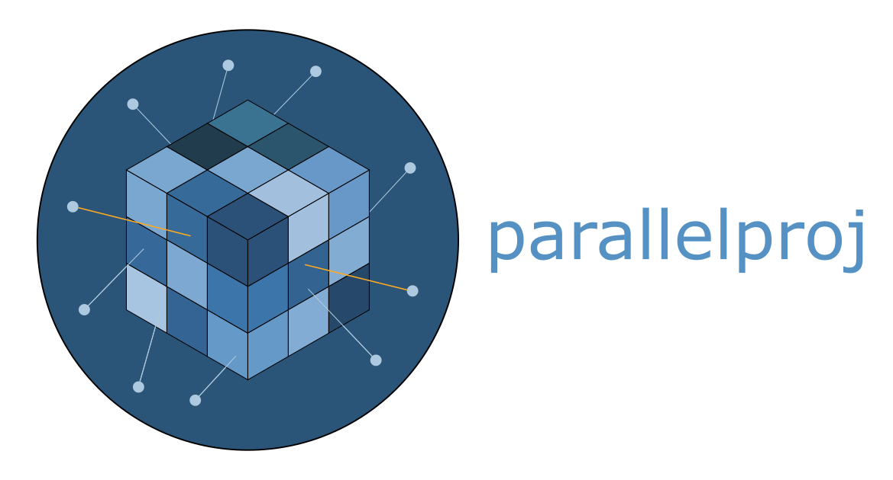

[](https://mybinder.org/v2/gh/KUL-recon-lab/parallelproj/main?labpath=examples)
[](https://codecov.io/gh/KUL-recon-lab/parallelproj)

<p align="center">

</p>

**parallelproj - high-level python routines for tomographic reconstruction**


**parallelproj** provides simple and fast high-level python routines for tomographic reconstruction
that are [python array API](https://data-apis.org/array-api/latest/) 
compatible meaning that they can be used with a variety of python
array libraries (e.g. numpy, cupy, **pytorch**) and devices (CPU and CUDA GPUs).

</br>

**If you are using parallelproj, we recommend to read and cite our publication** 
  - G. Schramm, K. Thielemans: "**PARALLELPROJ - An open-source framework for fast calculation of projections in tomography**", Front. Nucl. Med., Volume 3 - 2023, doi: 10.3389/fnume.2023.1324562, [link to paper](https://www.frontiersin.org/articles/10.3389/fnume.2023.1324562/abstract), [link to arxiv version](https://arxiv.org/abs/2212.12519)

</br>

## Installation, Documentation & Examples

**Please refer to the official documentation [here](https://parallelproj.readthedocs.io/en/stable/).**

</br>

## Developer Setup (pixi) — recommended

[Pixi](https://pixi.sh) is a cross-platform package manager that reads `pyproject.toml` and
builds a fully reproducible environment from a lock file — no manual environment setup or
`PYTHONPATH` configuration needed. The local clone is registered as a path dependency, so
`import parallelproj` always resolves to your working tree.

If you are already comfortable managing conda environments and setting `PYTHONPATH` yourself,
the [conda-based setup](#developer-setup-conda) in the next section works just as well.

**1. Clone the repository**

```bash
# default (main branch)
git clone https://github.com/KUL-recon-lab/parallelproj.git

# or a specific branch / tag
git clone -b <branch-or-tag> https://github.com/KUL-recon-lab/parallelproj.git
```

**2. Run examples interactively with IPython**

From the repo root, launch IPython with `docs/examples/` pre-set on `PYTHONPATH`:

```bash
pixi run ipython-examples                  # default env (CPU)
pixi run -e cuda12 ipython-examples        # CUDA 12 stack
pixi run -e cuda13 ipython-examples        # CUDA 13 stack
```

The environment is built automatically on first run. From within IPython, use `%run` to execute any example:

```python
%run docs/examples/01_pet_geometry/01_run_regular_polygon_pet_scanner.py
```

**3. Run your own scripts**

Since `parallelproj` is installed from the local clone, any script that does `import parallelproj`
works out of the box. Use `pixi shell` to drop into an activated shell — pick the environment
that matches your hardware:

```bash
pixi shell                   # default env (CPU)
pixi shell -e cuda12         # CUDA 12 stack
pixi shell -e cuda13         # CUDA 13 stack
```

Inside the shell you can run scripts directly with Python or explore them interactively with IPython:

```bash
python /path/to/your_script.py      # run as a script

ipython                             # start IPython, then:
# %run /path/to/your_script.py     # run inside IPython for interactive access to variables
```

Exit the shell with `exit` or `Ctrl+D`.

</br>

## Developer Setup (conda)

This workflow lets you run and modify the source directly from a local clone without installing the package.

**1. Create a conda environment with all dependencies**

`parallelproj-core` (the compiled C++/CUDA backend) must come from conda-forge.
Create a development environment that includes it along with the other runtime
dependencies and any optional extras you need:

```bash
# minimal (CPU/CUDA auto-detected)
mamba create -n parallelproj-dev -c conda-forge parallelproj-core numpy scipy array-api-compat matplotlib

# with PyTorch support
mamba create -n parallelproj-dev -c conda-forge parallelproj-core numpy scipy array-api-compat matplotlib pytorch

# with CuPy support
mamba create -n parallelproj-dev -c conda-forge parallelproj-core numpy scipy array-api-compat matplotlib cupy

mamba activate parallelproj-dev
```

**2. Clone the repository**

```bash
# default (main branch)
git clone https://github.com/KUL-recon-lab/parallelproj.git

# or a specific branch / tag
git clone -b <branch-or-tag> https://github.com/KUL-recon-lab/parallelproj.git
```

**3. Add the local clone to PYTHONPATH**

The importable package lives under `src/`, so point `PYTHONPATH` there:

```bash
export PYTHONPATH=/path/to/parallelproj/src:$PYTHONPATH
```

This makes `import parallelproj` pick up your local clone instead of any installed version.

**4. Run the examples**

The examples in `docs/examples/` share small helper modules (`array_utils.py`,
`img.py`, `vis.py`) that live in `docs/examples/` itself and are not part of
the installed package.  Add that directory to `PYTHONPATH` as well:

```bash
export PYTHONPATH=/path/to/parallelproj/docs/examples:$PYTHONPATH
```

You can then run any example or your own scripts directly:

```bash
python /path/to/parallelproj/docs/examples/01_pet_geometry/01_run_regular_polygon_pet_scanner.py
python /path/to/your_script.py
```
